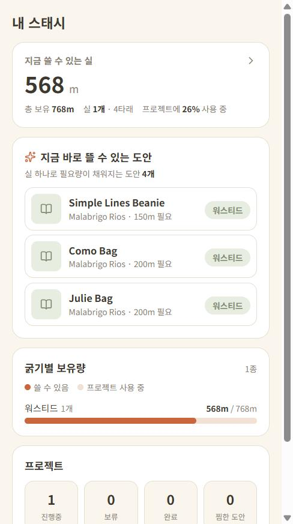
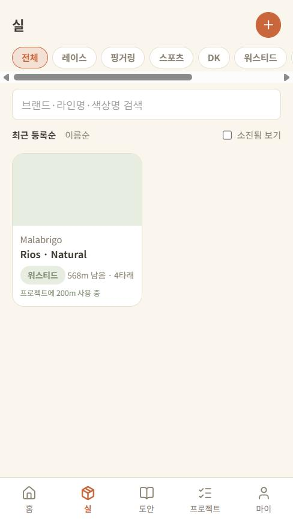
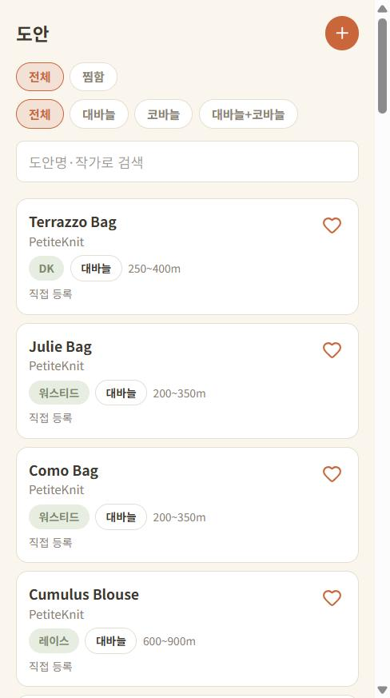
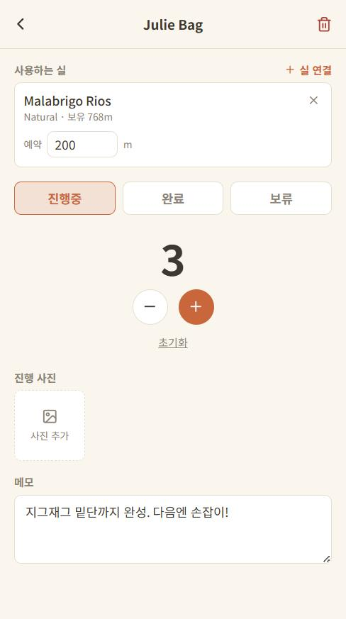

# Yarn Stash Tracker

[한국어](README.md)

A personal inventory app for knitters and crocheters. Register the yarn you own and get pattern recommendations you can actually knit with it — or start from a pattern you like and check whether any of your yarn would work for it.

**[Live demo →](https://yarn-stash-flax.vercel.app/)** (usable immediately as a guest; the backend runs on Render's free tier, so the first request after idling can take up to a few dozen seconds to cold-start)

## Screenshots

| Home dashboard | Yarn list | Pattern list | Project detail |
|---|---|---|---|
|  |  |  |  |

## Key Features

- **Bidirectional yarn ↔ pattern matching**: Matches on weight-category compatibility and yardage sufficiency (owned vs. required), scored on a four-level scale — plenty / sufficient / tight / insufficient. Also flags gauge approximation and dye-lot matching as supporting signals.
- **Local DB + Ravelry hybrid search**: When registering yarn or patterns, the local database is queried first; if nothing matches, it falls back to the Ravelry API and caches only the item the user actually selects.
- **Guest-first authentication**: Usable immediately without signing in. Guest data is carried over seamlessly when the user later upgrades to Kakao/Google login.
- **Project tracker**: Once a project is started from a pattern, track it with a row counter, progress photos, and status (in progress / completed / on hold).
- **Home dashboard**: One screen showing how many meters of yarn are actually available right now, how the stash breaks down by weight category, and how many patterns can be started immediately with what is on hand.
- **Automatic stash deduction**: Linking yarn to a project reserves that amount, so it drops out of other patterns' matches. Completing the project confirms the actual amount used. Deleting the project or unlinking the yarn restores the stash — so yarn you have already used up never keeps showing as "sufficient".
- **Multilingual UI**: Switch between Korean and English from the My tab; the choice is saved on the device and persists across visits.

Background on the feature set and data model is in [`docs/실_스태시_트래커_기획서.md`](docs/실_스태시_트래커_기획서.md) (Korean), and per-screen specs are in [`docs/실_스태시_트래커_화면설계서.md`](docs/실_스태시_트래커_화면설계서.md) (Korean).

## Tech Stack

| Area | Stack |
|---|---|
| Frontend | React 19, Vite, TypeScript, React Router, TanStack Query, Tailwind CSS, react-i18next |
| Backend | Nest.js, Prisma, PostgreSQL |
| Auth | JWT (localStorage) + Kakao/Google OAuth |
| Images | Cloudinary (direct client-side upload) |
| External integration | Ravelry API |

## Folder Structure

```
backend/    Nest.js API server (see backend/README.md for details)
frontend/   React client (see frontend/README.md for details)
docs/       Product spec, screen spec, initial UI prototype, dev kickoff prompt
```

## Getting Started

Both servers need to be started separately.

```bash
# Backend
cd backend
npm install
cp .env.example .env   # fill in DATABASE_URL (Neon), etc.
npx prisma migrate dev --name init
npx prisma db seed
npm run start:dev

# Frontend (separate terminal)
cd frontend
npm install
cp .env.example .env   # fill in backend API URL, etc.
npm run dev
```

Each folder's README has more detailed run options and current implementation status.

## License

[MIT](LICENSE)
